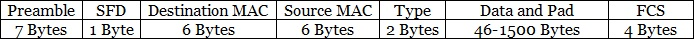
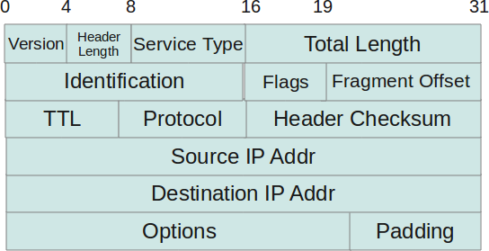
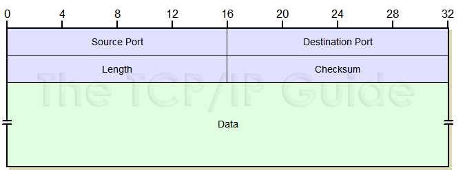
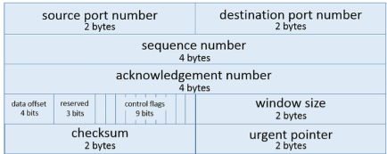

# Laag 1

Laag 1 is de fysieke laag. Het gaat dan over afspraken over kabels,  elektromagnetische transmissiestandaarden, ...

B.v. enkele standaarden die (grotendeels) thuishoren in laag 1:

- 1000BASE-T
- 1000BASE-SX
- IEEE 802.3ab
- 802.11ac
- 802.11ax
- ...

# Laag 2

Een MAC-adres bestaat uit 6 bytes:
- 3 bytes fabrikant
- 3 bytes serienummer

B.v. het MAC-adres `ac-16-2d-0d-49-45`

```
ac-16-2d: Hewlett Packard
0d-49-45: toestelnummer (uniek nummer per NIC)
```

Elk pakket heeft op laag 2 een header waarin o.a. source- en destination-MAC-adres zitten.



Soms is een destination-adres `FF:FF:FF:FF:FF:FF`. Dit is een broadcast-adres wat betekent dat het pakket bedoeld is voor gans het lokale netwerk.


Begrippen i.v.m. hoe de pakketjes op laag 2 
- **Collision domain** (worden van elkaar gescheiden door bridge/switches wat het aantal pakketjes op het fysieke netwerk en dus het aantal (elektromagnetische) botsingen verminderd)
- **Broadcast domain** (alle hosts die bereikbaar zijn met `FF:FF:FF:FF:FF:FF`)


## Weetjes

- MAC-adressen worden soms gebroadcast door WiFi- en bluetooth-adapters en kunnen opgevangen worden, b.v. wanneer je rondwandelt in een winkel of stad. Daarom genereren smartphones tegenwoordig soms random valse MAC-adressen om privacy-redenen
- Een DHCP-server kan een lijst van MAC-adres-reservaties opslaan zodat steeds hetzelfde IP-adres kan worden uitgedeeld aan dezelfde host.

## ARP

ARP (Address Resolution Protocol) is een belangrijk laag 2-protocol. Het gaat in het lokale netwerk op zoek naar MAC-adres van de adapter waaraan een bepaald IP-adres is gegeven, tenzij dit MAC-adres al in de **ARP-cache** v.d. host zit.

Het werkt met `Request`'s en `Reply`'s.
Essentieel aan de werking is dat sommige `Request`'s naar het broadcast-adres `FF:FF:FF:FF:FF:FF` worden gestuurd. Dit komt natuurlijk omdat ARP aan gans het netwerk wil vragen welke host geconfigureerd met het het IP-adres waarnaar een pakketje moet verzonden worden.

> Hoewel ARP dus ook samenwerkt met laag 3, is het toch een laag 2-protocol omdat ARP ook kan werken met andere dan IP-netwerken.

Praktisch:

- `arp -a`: toont de ARP-cache
- `arp -d *`: verwijdert alle entries uit de ARP-cache


## Laag 3



- `Get-NetRoute`
- 

## Laag 4





We zien aan de complexiteit v.d. TCP-header hoe dit transportlaagprotocol een complexere werking heeft dan het UDP-protocol.

## Hogere lagen
De meeste hogere lagen (DNS, HTTP, ...) hebben geen vaste grootte en bestaan vaak zelfs enkel uit tekst.

