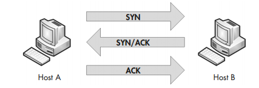
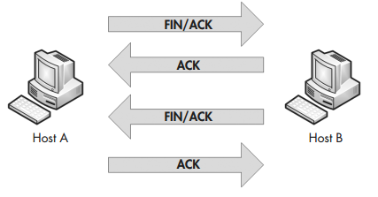

# Laag 1

Laag 1 is de fysieke laag. Het gaat dan over afspraken over kabels,  elektromagnetische transmissiestandaarden, ...

B.v. enkele standaarden die (grotendeels) thuishoren in laag 1:

- 1000BASE-T
- 1000BASE-SX
- IEEE 802.3ab
- 802.11ac
- 802.11ax
- ...

# Laag 2

Een MAC-adres bestaat uit 6 bytes:
- 3 bytes fabrikant
- 3 bytes serienummer

B.v. het MAC-adres `ac-16-2d-0d-49-45`

```
ac-16-2d: Hewlett Packard
0d-49-45: toestelnummer (uniek nummer per NIC)
```

Elk pakket heeft op laag 2 een header waarin o.a. source- en destination-MAC-adres zitten.


Soms is een destination-adres `FF:FF:FF:FF:FF:FF`. Dit is een broadcast-adres wat betekent dat het pakket bedoeld is voor gans het lokale netwerk.


Begrippen i.v.m. hoe de pakketjes op laag 2 
- **Collision domain** (worden van elkaar gescheiden door bridge/switches wat het aantal pakketjes op het fysieke netwerk en dus het aantal (elektromagnetische) botsingen verminderd)
- **Broadcast domain** (alle hosts die bereikbaar zijn met `FF:FF:FF:FF:FF:FF`)


## Weetjes

- MAC-adressen worden soms gebroadcast door WiFi- en bluetooth-adapters en kunnen opgevangen worden, b.v. wanneer je rondwandelt in een winkel of stad. Daarom genereren smartphones tegenwoordig soms random valse MAC-adressen om privacy-redenen
- Een DHCP-server kan een lijst van MAC-adres-reservaties opslaan zodat steeds hetzelfde IP-adres kan worden uitgedeeld aan dezelfde host.

## ARP

**ARP (Address Resolution Protocol)** is een belangrijk laag 2-protocol. Het gaat in het lokale netwerk op zoek naar MAC-adres van de adapter waaraan een bepaald IP-adres is gegeven, tenzij dit MAC-adres al in de **ARP-cache** v.d. host zit.

Het werkt met `Request`'s en `Reply`'s.
Essentieel aan de werking is dat sommige `Request`'s naar het broadcast-adres `FF:FF:FF:FF:FF:FF` worden gestuurd. Dit komt natuurlijk omdat ARP aan gans het netwerk wil vragen welke host geconfigureerd met het het IP-adres waarnaar een pakketje moet verzonden worden.

> Voor de exacte inhoud van de **ARP-Request** en **-Reply**-pakketten, gebruik **Wireshark**!

> Hoewel ARP dus ook samenwerkt met laag 3, is het toch een laag 2-protocol omdat ARP ook kan werken met andere dan IP-netwerken.

Praktisch:

- `arp -a`: toont de ARP-cache
- `arp -d *`: verwijdert alle entries uit de ARP-cache
- `Get-NetNeighbor`


## Laag 3


Praktisch:
- `ping`
- `Test-NetConnection`
- `tracert 8.8.8.8`: begint een zoektocht naar alle routers tussen de client en 8.8.8.8
- `Get-NetIPAddress`
- `Get-NetIPConfiguration`
-  `route print`: roont de route-tabellen
- `Get-NetRoute`


## Laag 4

Typisch aan laag 4 is het gebruik van **poortnummers**.

> In `C:\Windows\system32\drivers\etc\services` vind je op een oplijsting van wat de standaard poortnummers zijn voor verschillende protocols, b.v. DNS: 53, HTTP: 80, ...
> Opgelet: het gaat hier over de poortnummer aan de **server**-kant!


We zien aan de complexiteit v.d. TCP-header hoe dit transportlaagprotocol een complexere werking heeft dan het UDP-protocol.

Zowel UDP als TCP hebben voor hun source- en destination-port een 16-bit getal, dus 2^16 = 65536 mogelijke poorten (uitgezonderd 0).

Clients genereren een random poortnummer. Servers luisteren naar een welbepaald poortnummer. Samengevat:

- Bij **requests** (van client naar server)
	- source-port: random
	- destination-port: luisterende poort op de server
- Bij **responses** (van server naar client)
	- source-port: de luisterende poort op de server
	- destination-port: de initiële random-poort van de client


Met TCP zetten we een connectie/sessie op.
Hiervoor is een handshake nodig:



Ook voor het afbreken van een TCP-sessie bestaat een handshake (**teardown**):



`SYN`, `ACK` en `FIN` zijn 3 van de (bit-)vlaggen die in de TCP-header aanwezig zijn en kunnen gezet worden.

UDP-verbindingen zijn **best-effor**: ze worden verzonden maar er is op de transportlaag geen controle of ze aangekomen zijn.

TCP-verbindingen gebruiken de velden **sequence number** en **acknowledge number** om aan te geven hoeveel pakketjes al correct zijn overgebracht.

Praktisch:


- `netstat -a`: toont alle recente UDP- en actieve TCP-verbindingen
- `netstat -l`: toont alle **luisterend** verbindngen
- `Get-NetTCPConnection`
- `Get-NetUDPEndpoint`


## Hogere lagen
De meeste hogere lagen hebben geen vaste grootte en bestaan vaak zelfs enkel uit tekst.

Enkele noemenswaardige applicatielaag-protocols:

- DNS: Domain Name Service (om domeinnamen om te zetten naar IP-adressen)
- NTP: Network Time Protocol (om tussen hosts de klok te synchroniseren)
- HTTP: HyperText Transfer Protocol (om hypertext (o.a. HTML-bestanden) te transfereren)

Praktisch:

- `Get-Command -Module DnsClient`
	- `Resolve-DnsName www.twitter.com`
	- `Get-DnsClientCache`
	- `Clear-DnsClientCache`
- `nslookup www.twitter.com`

