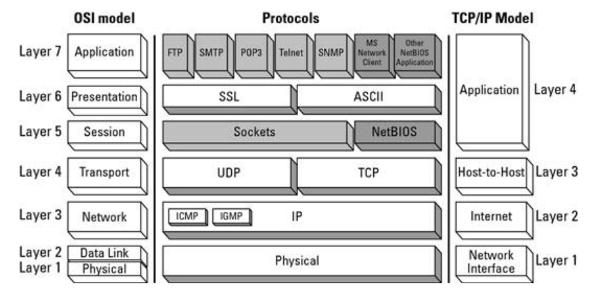
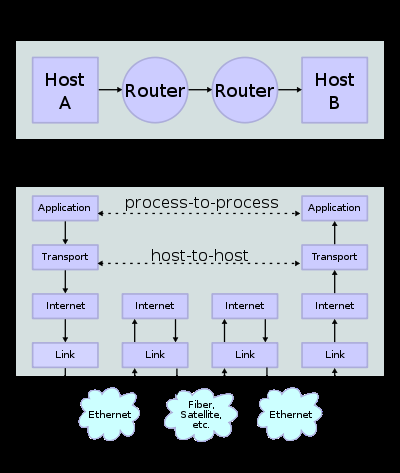

# NetwerkenPW

## Lagenmodel

Het netwerklagenmodel is een belangrijkste kapstop waar we alle theorie en zelfs de meeste praktijk aan ophangen.

Zie [README](Lagen/README.md) voor een samenvatting van elke laag.

Het is belangrijk om in het achterhoofd te houden dat een grote verscheidenheid aan netwerkapparaten aan elkaar gekoppeld (volgens  bepaalde topologieën zoals mesh, ster, ...) die op verschillende manieren met elkaar communiceren. Het lagenmodel schept hierin meer duidelijkheid:

- een client- en server-**proces** begrijpen elkaars berichten op de **applicatielaag** (b.v. een webbrowser en een webserver spreken HTTP met elkaar)
- de OS's waarop elk proces draait, voorzien via de **transportlaag** en **poortnummers** waarlangs client- en server-proces elkaar kunnen bereiken
- alle routers op de **netwerklaag** die aanwezig zijn tussen client en servers, zorgen dat de pakketten op de juiste hosts (machines) terecht komen dankzij het **IP-adres** dat elke machine heeft (of eventueel dankzij NAT-routing ook bij hosts met private adressen goed terecht komt)
- de **datalink-laag** verbindt apparaten met elkaar met de juiste fysieke eigenschappen, (sommige apparaten kunnen een link zijn tussen 2 fysieke netwerk, b.v. een UTP-naar-fiber-**bridge** maar ook **switches**)

## TCP/IP-configuratie

Elke host in een netwerk moet geconfigureerd worden, hetzij automatisch of manueel.

Zie [README](TCPIPConfig/README.md)

## Netwerksnelheid

Er zijn 2 soorten snelheden waar we rekening mee moeten houden:

- latency (gemeten in `ms`: milli-seconden)
- bandbreedte (gemeten in `bps`: bits per seconde)

8 bps = 1 byte per seconde

