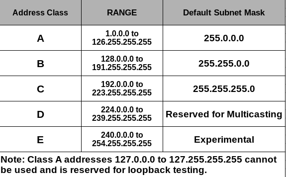

# TCP/IP-configuratie

## Basis

Verplicht:

- **IP-adres**
- **subnetmasker**

Optioneel:

- **standaard-gateway**

Vanaf dan heb je Internet-connectiviteit: `ping 8.8.8.8` werkt!

Soms wordt hiet ook nog het adres van een DNS-server onder verstaan maar strict genomen is dit niet

DNS-servers van Google:

- `8.8.8.8`
- `8.8.4.4`

## Klasses van IP-adressen

Dit zijn enkele voorbeelden van 
- Class A-adressen:
	- `1.0.0.1/8`
	- `125.240.200.8/8`
	- ..
	- Gereserveerd voor privaat gebruik: `10.0.0.0/8`
	- Gereserveerd voor local loopback: `127.0.0.0/8` (verkeer wordt nooit op een netwerkkabel gezet)
- Class B-adressen:
	- `128.0.0.1/16`
	- `191.255.205.3/16`
	- Gereserveerd voor privaat gebruik: `172.16.0.0/12` - `172.31.255.255/12` (opgelet: `/12`!)
- Class C-adressen
	- `192.0.4.5/24`
	- `223.4.67.2/24`
	- Gereserveerd voor privaat gebruik: `192.168.0.0/24`

## APIPA

Wanneer een host staat ingesteld op automatisch een IP-adres verkrijgen maar geen DHCP-server gevonden wordt en de host zichzelf dan maar een IP-adres geeft.

Hiervoor is een gans IP-netwerk gereserveerd: `169.254.0.0/16`

## DHCP

Dynamic Host Configuration Protocol

# Netwerkprofielen in client-OS

- `Get-NetConnectionProfile`
- `Set-NetConnectionProfile`
- `firewall.cpl`
- `WF.msc`

